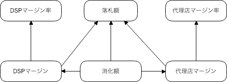

### ドメインモデルで実装する
### 金額計算

</br>

2019-01-28

@orepuri

---

### 自己紹介

</br>

* Takanori Ikeda (@orepuri)

* ソフトウェアエンジニア</span>

* インターネット広告業界で約10年間勤務</span>

* フリーランス</span>

* Scala, Java

---

### 本日の話

</br>

金額計算をドメインモデルで実装する話

</br>
RTBで落札額からDSP/代理店マージンや</br>
消化金額を計算する処理

---

### 各金額計算の仕様

</br>

<div style="padding-left: 120px;">
<p style="text-align: left; font-size: 80%;">
落札額 = 入札に対してSSPが決定する落札の金額</br></br>

DSPマージン = 落札額 \* DSPマージン率</br></br>

代理店マージン = 落札額 \* 代理店マージン率</br></br>

消化金額 = 落札額 + 代理店マージン + DSPマージン</br></br>
</p>
</div>

---

### 具体例

</br>

<div style="padding-left: 120px;">
<p style="text-align: left; font-size: 80%;">
落札額 = 100円</br></br>

DSPマージン率 = 20%,  代理店マージン率 = 20%</br></br>

DSPマージン = 100円 \* 20% = 20円</br></br>

代理店マージン = 100円 \* 20% = 20円</br></br>

消化金額 = 100円 + 20円 + 20円 = 140円</br></br>
</p>
</div>

---

### ドメインモデルがない実装

```scala
def cacululate(
  winningPrice: BigDecimal,
  dspMarginRate: BigDecimal,
  agencyMarginRate: BigDecimal): (BigDecimal, BigDecimal, BigDecimal) = {

  val dspMargin = winningPrice * dspMarginRate

  val agencyMargin = winningPrice * agencyMarginRate

  val spending = dspMargin + agencyMargin + winningPrice

  (dspMargin, agencyMargin, spending)
}
```

---

### 金額計算のドメインモデル



---

### ドメインモデルの実装

```scala
case class WinningPrice(amount: BigDecimal) extends AnyVal

case class DspMarginRate(value: BigDecimal) extends AnyVal

case class AgencyMarginRate(value: BigDecimal) extends AnyVal

case class DspMargin(winningPrice: WinningPrice, rate: DspMarginRate) {

  def amount: BigDecimal = winningPrice.amount * rate.value
}

// AgencyMargin省略
```

---

### ドメインモデルの実装

```scala
// 消化金額
case class Spending(winningPrice: WinningPrice, dspMargin: DspMargin,
  agencyMargin: AgencyMargin) {

  def amount: BigDecimal = winningPrice.amount +
    dspMargin.amount + agencyMargin.amount
}
```

---

### ドメインモデルの実装

```scala
def cacululate(
  winningPrice: WinningPrice,
  dspMarginRate: DspMarginRate,
  agencyMarginRate: AgencyMarginRate): Spending = {

  val dspMargin = DspMargin(winningPrice, dspMarginRate)

  val agencyMargin = AgencyMargin(winningPrice, agencyMarginRate)

  Spending(winningPrice, dspMargin, agencyMargin)
}
```

---

### ドメインモデルのメリット

</br>

```scala
case class DspMargin(winningPrice: WinningPrice, rate: DspMarginRate) {

  def amount: BigDecimal = winningPrice.amount * rate.value
}
```

仕様を直接的にコードで表現できる</br>
型安全に計算することができる</br>

<div style="font-size: 50%;">DspMarginはWinningPriceとDspMarginRateから算出される(からしか算出できない)</div>

<div style="font-size: 50%;">間違ってAgecnyMarginRateから算出することはない</div>

---

### 仕様は変わる

<br>

消化金額にDMPのマージンも含めたい

代理店は複数存在する

マージン率の適応対象を変えたい, etc

</br>

どこを修正すればいいのかがわかりやすく</br>

修正の影響範囲は限定されているべき

---

### ドメインモデルで仕様を実装する

</br>

わかりやすさ

DSPマージンの計算はDspMargin</br>
消化金額の計算はSpending</br>
複数の代理店マージンの計算はAgencyMargins</br>

修正範囲の限定

DSPマージンはDspMarginの中でだけ計算される</br>
同じ計算が複数箇所に重複して存在しない

---

### 別の例: 金額の値

</br>

今のモデルでは各種金額の値自体はBigDecimalで表現

落札額の単位はSSPによって異なる

CPM, CPI, CPM Micros, etc...

---

### 金額のドメインモデル

```scala
// 金額単位のモデル
sealed trait PriceUnit

object PriceUnits {
 case object Cpm extends PriceUnit
 case object Cpi extends PriceUnit
 case object CpmMicros extends PriceUnit
}
```

---

### 金額のドメインモデル

```scala
case class Price(amount: BigDecimal, unit: PriceUnit) {
 // 単位変換
 def cpm: Price = unit match {
   case Cpm       => this
   case Cpi       => Price.cpm(amount * 1000)
   case CpmMicros => Price.cpm(amount / (1000 * 100))
 }
 def cpi: Price = ...
 def cpmMicros: Price = ...

 def +(that: Price): Price = unit match {
   case Cpm       => copy(amount + that.cpm.amount)
   case Cpi       => copy(amount + that.cpi.amount)
   case CpmMicros => copy(amount + that.cpmMicros.amount)
 }
}
```
---

### 金額のドメインモデル

```scala
// 使用例
val price1 = Price.cpi(2)　// => Price(2, PriceUnits.Cpi)
val price2 = Price.cpm(1)  // => Price(1, PriceUnits.Cpm)

val price3 = price1 + price2 // => Price(1002, PriceUnits.Cpi)

val price4 = price3.cpm // => Price(1.002, PriceUnits.Cpm)

price3 == price4 // => true
```

金額がCPMなのかCPIなのか</br>

変数名ではなくモデルで表現する

---

### まとめ

</br>

金額計算をドメインモデルで実装する例</br>

ドメインモデルをベースにした実装は</br>
仕様を直接的に表現したものになり,

わかりやすく理解や変更がしやすいコードになる

